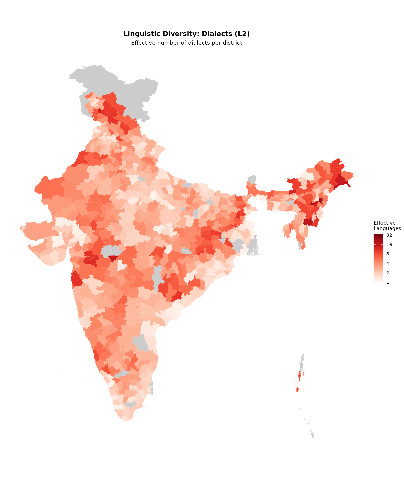

# Mapping linguistic diversity

India is one of the most linguistically diverse countries in the world.
The 2011 Census recorded over 19,500 languages and dialects. This
vignette demonstrates how to visualize this diversity using Shannon
entropy.

## Load data

``` r
library(indiacensus)
library(dplyr)
```

``` r
data(census_2011_mother_tongue)

census_2011_mother_tongue |>
  filter(district_code == "000") |>
  group_by(language_level) |>
  summarise(n_languages = n_distinct(language_name))
#> # A tibble: 2 × 2
#>   language_level n_languages
#>   <chr>                <int>
#> 1 L1                     122
#> 2 L2                     355
```

The C-16 tables classify languages as:

- **L1**: 22 Scheduled Languages recognized in the Constitution
- **L2**: Dialects and variants within each scheduled language

## Calculate Shannon entropy

The **effective number of languages** ($2^{H}$) gives an intuitive
interpretation: a district with $2^{H} = 4$ has diversity equivalent to
four equally-spoken languages.

``` r
calculate_diversity <- function(data, level) {
  data |>
    filter(language_level == level, district_code != "000", !grepl("Others", language_name)) |>
    group_by(state_code, state_name, state_name_harmonized, district_code, area_name) |>
    mutate(proportion = total_persons / sum(total_persons)) |>
    summarise(
      n_languages = n(),
      shannon_entropy = -sum(proportion * log2(proportion), na.rm = TRUE),
      effective_languages = 2^shannon_entropy,
      .groups = "drop"
    )
}

diversity_l1 <- calculate_diversity(census_2011_mother_tongue, "L1")
diversity_l2 <- calculate_diversity(census_2011_mother_tongue, "L2")

cat("L1 (Scheduled Languages):\n")
#> L1 (Scheduled Languages):
summary(diversity_l1$effective_languages)
#>    Min. 1st Qu.  Median    Mean 3rd Qu.    Max. 
#>   1.000   1.123   1.453   1.862   2.105  18.190

cat("\nL2 (Dialects):\n")
#> 
#> L2 (Dialects):
summary(diversity_l2$effective_languages)
#>    Min. 1st Qu.  Median    Mean 3rd Qu.    Max. 
#>   1.000   1.251   1.727   2.242   2.544  22.844
```

## Prepare map data

``` r
districts_sf <- get_census_boundaries(2011, "district") |>
  mutate(district_key = tolower(gsub("[^a-z0-9 ]", "", district_name)))

prepare_diversity <- function(div_data) {
  div_data |>
    mutate(district_key = tolower(gsub("[^a-z0-9 ]", "", gsub(" District$", "", area_name))))
}

map_l1 <- left_join(
  districts_sf,
  prepare_diversity(diversity_l1) |> select(state_name_harmonized, district_key, effective_languages),
  by = c("state_name_harmonized", "district_key")
)

map_l2 <- left_join(
  districts_sf,
  prepare_diversity(diversity_l2) |> select(state_name_harmonized, district_key, effective_languages),
  by = c("state_name_harmonized", "district_key")
)
```

## L1: Scheduled languages diversity

``` r
plot_map(
  map_l1,
  fill_var = "effective_languages",
  title = "Linguistic diversity: Scheduled languages (L1)",
  subtitle = "Effective number of languages per district",
  legend_title = "Effective\nLanguages",
  palette = "reds",
  show_state_boundaries = TRUE,
  trans = "log2",
  limits = c(1, 18),
  breaks = c(1, 2, 4, 8, 16)
)
```


## L2: Dialect-level diversity

``` r
plot_map(
  map_l2,
  fill_var = "effective_languages",
  title = "Linguistic diversity: Dialects (L2)",
  subtitle = "Effective number of dialects per district",
  legend_title = "Effective\nLanguages",
  palette = "reds",
  show_state_boundaries = TRUE,
  trans = "log2",
  limits = c(1, 35),
  breaks = c(1, 2, 4, 8, 16, 32)
)
```



## Most diverse districts

``` r
cat("Top 10 by scheduled languages (L1):\n")
#> Top 10 by scheduled languages (L1):
diversity_l1 |>
  arrange(desc(effective_languages)) |>
  select(state_name_harmonized, area_name, effective_languages) |>
  head(10)
#> # A tibble: 10 × 3
#>    state_name_harmonized area_name     effective_languages
#>    <chr>                 <chr>                       <dbl>
#>  1 Manipur               Churachandpur                18.2
#>  2 Nagaland              Chumukedima                  16.5
#>  3 Nagaland              Dimapur                      15.7
#>  4 Nagaland              Dimapur Sadar                14.1
#>  5 Nagaland              Kohima Sadar                 12.6
#>  6 Assam                 Udalguri                     12.0
#>  7 Arunachal Pradesh     Jairampur                    11.9
#>  8 Manipur               Chandel                      11.8
#>  9 Arunachal Pradesh     Kibithoo                     11.3
#> 10 Arunachal Pradesh     Changlang                    11.2

cat("\nTop 10 by dialects (L2):\n")
#> 
#> Top 10 by dialects (L2):
diversity_l2 |>
  arrange(desc(effective_languages)) |>
  select(state_name_harmonized, area_name, effective_languages) |>
  head(10)
#> # A tibble: 10 × 3
#>    state_name_harmonized area_name            effective_languages
#>    <chr>                 <chr>                              <dbl>
#>  1 Nagaland              Kohima Sadar                        22.8
#>  2 Nagaland              Zunheboto                           22.7
#>  3 Nagaland              Chumukedima                         22.0
#>  4 Nagaland              Dimapur                             20.4
#>  5 Nagaland              Zunheboto Sadar                     19.2
#>  6 Manipur               Churachandpur                       17.0
#>  7 Dadra & Nagar Haveli  Dadra & Nagar Haveli                16.2
#>  8 Nagaland              Dimapur Sadar                       15.9
#>  9 Arunachal Pradesh     Kharsang                            15.3
#> 10 Arunachal Pradesh     Changlang                           14.7
```
