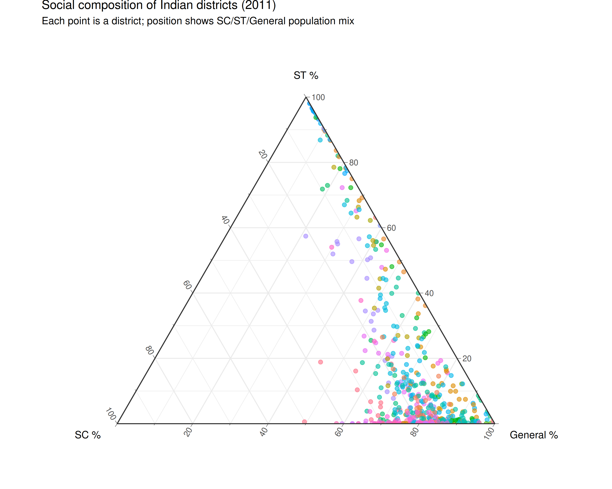
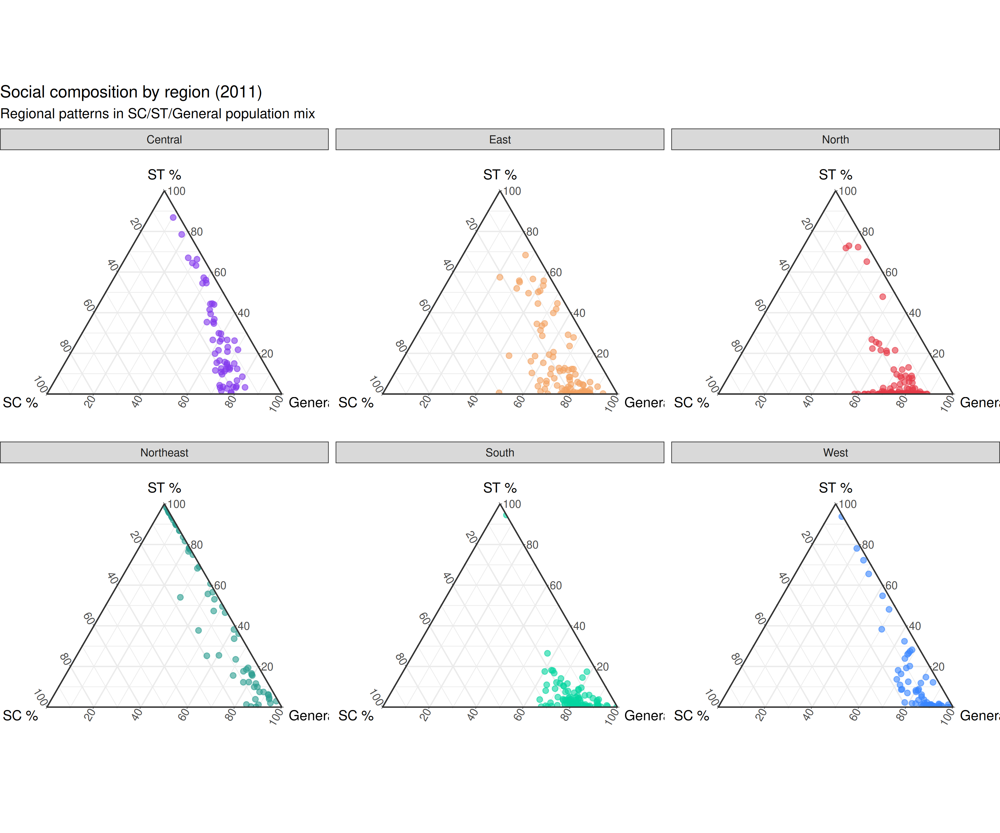
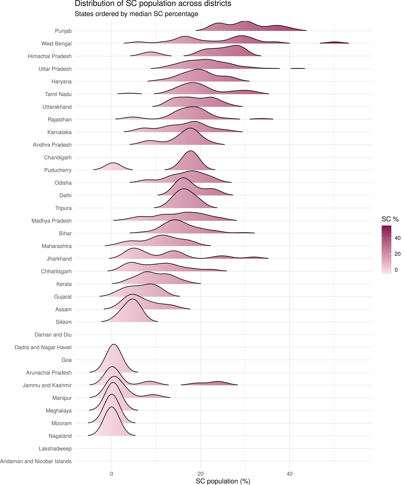
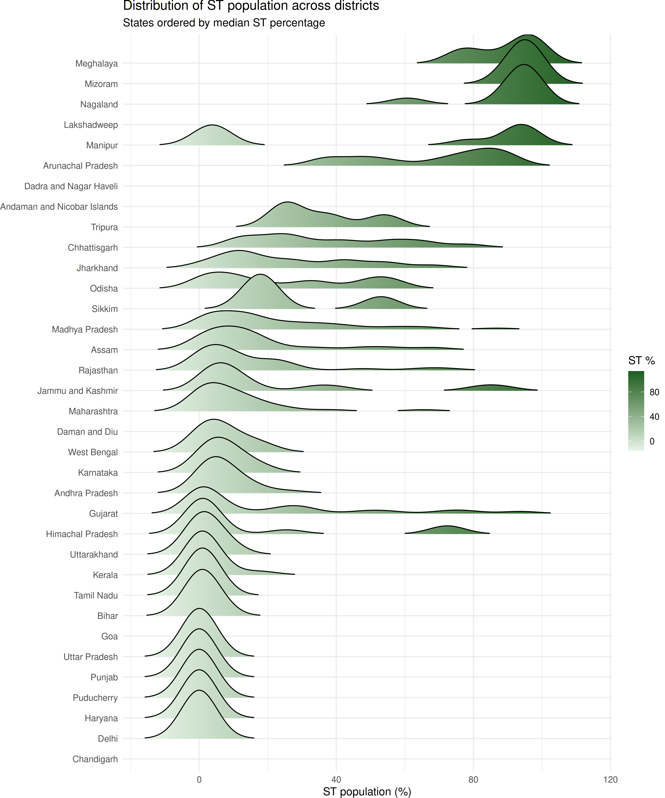
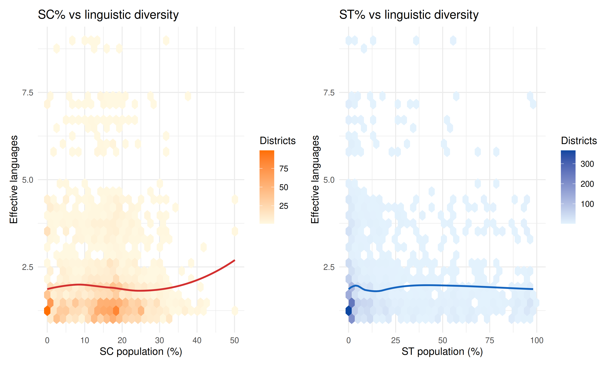

# Social composition

``` r
library(indiacensus)
library(dplyr)
library(ggplot2)
library(ggtern)
library(ggridges)
library(patchwork)
```

This vignette explores the social composition of India using SC, ST, and
general population data.

## SC/ST/General composition

Districts can be characterized by their mix of Scheduled Caste,
Scheduled Tribe, and general population.

``` r
# Get 2011 district data with SC/ST
composition <- census_2011_pca |>
  filter(geography == "district") |>
  mutate(
    sc_pct = 100 * sc_population / population_total,
    st_pct = 100 * st_population / population_total,
    general_pct = 100 - sc_pct - st_pct
  ) |>
  filter(!is.na(sc_pct), !is.na(st_pct), general_pct >= 0)

ggtern(composition, aes(x = sc_pct, y = st_pct, z = general_pct)) +
  geom_point(aes(color = state_name_harmonized), alpha = 0.6, size = 2) +
  labs(
    x = "SC %",
    y = "ST %",
    z = "General %",
    title = "Social composition of Indian districts (2011)",
    subtitle = "Each point is a district; position shows SC/ST/General population mix"
  ) +
  theme_bw() +
  theme(
    legend.position = "none",
    ggtern.panel.background = element_rect(fill = "white")
  )
```



## Regional patterns

``` r
regions <- tibble::tribble(
  ~state_name_harmonized, ~region,
  "Jammu & Kashmir", "North",
  "Himachal Pradesh", "North",
  "Punjab", "North",
  "Chandigarh", "North",
  "Uttarakhand", "North",
  "Haryana", "North",
  "Nct Of Delhi", "North",
  "Rajasthan", "North",
  "Uttar Pradesh", "North",
  "Bihar", "East",
  "West Bengal", "East",
  "Jharkhand", "East",
  "Odisha", "East",
  "Sikkim", "Northeast",
  "Arunachal Pradesh", "Northeast",
  "Nagaland", "Northeast",
  "Manipur", "Northeast",
  "Mizoram", "Northeast",
  "Tripura", "Northeast",
  "Meghalaya", "Northeast",
  "Assam", "Northeast",
  "Chhattisgarh", "Central",
  "Madhya Pradesh", "Central",
  "Gujarat", "West",
  "Daman & Diu", "West",
  "Dadra & Nagar Haveli", "West",
  "Maharashtra", "West",
  "Goa", "West",
  "Andhra Pradesh", "South",
  "Karnataka", "South",
  "Kerala", "South",
  "Tamil Nadu", "South",
  "Puducherry", "South",
  "Lakshadweep", "South",
  "Andaman & Nicobar Islands", "Islands",
  "Telangana", "South"
)

region_colors <- c(
  "North" = "#e63946",
  "East" = "#f4a261",
  "Northeast" = "#2a9d8f",
  "Central" = "#8338ec",
  "West" = "#3a86ff",
  "South" = "#06d6a0",
  "Islands" = "#adb5bd"
)

composition_region <- composition |>
  left_join(regions, by = "state_name_harmonized") |>
  filter(!is.na(region))

ggtern(composition_region, aes(x = sc_pct, y = st_pct, z = general_pct)) +
  geom_point(aes(color = region), alpha = 0.6, size = 2) +
  facet_wrap(~region, ncol = 3) +
  scale_color_manual(values = region_colors) +
  labs(
    x = "SC %",
    y = "ST %",
    z = "General %",
    title = "Social composition by region (2011)",
    subtitle = "Regional patterns in SC/ST/General population mix"
  ) +
  theme_bw() +
  theme(
    legend.position = "none",
    ggtern.panel.background = element_rect(fill = "white")
  )
```



## SC population distribution by state

``` r
state_order <- composition |>
  group_by(state_name_harmonized) |>
  summarise(median_sc = median(sc_pct, na.rm = TRUE)) |>
  arrange(median_sc) |>
  pull(state_name_harmonized)

composition |>
  filter(state_name_harmonized %in% state_order) |>
  mutate(state_name_harmonized = factor(state_name_harmonized, levels = state_order)) |>
  ggplot(aes(x = sc_pct, y = state_name_harmonized, fill = stat(x))) +
  geom_density_ridges_gradient(scale = 2, rel_min_height = 0.01) +
  scale_fill_gradient(low = "#fce4ec", high = "#880e4f", name = "SC %") +
  labs(
    x = "SC population (%)",
    y = NULL,
    title = "Distribution of SC population across districts",
    subtitle = "States ordered by median SC percentage"
  ) +
  theme_minimal() +
  theme(legend.position = "right")
```



## ST population distribution by state

``` r
state_order_st <- composition |>
  group_by(state_name_harmonized) |>
  summarise(median_st = median(st_pct, na.rm = TRUE)) |>
  arrange(median_st) |>
  pull(state_name_harmonized)

composition |>
  filter(state_name_harmonized %in% state_order_st) |>
  mutate(state_name_harmonized = factor(state_name_harmonized, levels = state_order_st)) |>
  ggplot(aes(x = st_pct, y = state_name_harmonized, fill = stat(x))) +
  geom_density_ridges_gradient(scale = 2, rel_min_height = 0.01) +
  scale_fill_gradient(low = "#e8f5e9", high = "#1b5e20", name = "ST %") +
  labs(
    x = "ST population (%)",
    y = NULL,
    title = "Distribution of ST population across districts",
    subtitle = "States ordered by median ST percentage"
  ) +
  theme_minimal() +
  theme(legend.position = "right")
```



## Linguistic diversity vs social composition

Do areas with high SC/ST populations show different linguistic patterns?

``` r
diversity <- census_2011_mother_tongue |>
  filter(language_level == "L1", district_code != "000", !grepl("Others", language_name)) |>
  group_by(state_name, district_code, area_name) |>
  mutate(proportion = total_persons / sum(total_persons)) |>
  summarise(
    effective_languages = 2^(-sum(proportion * log2(proportion), na.rm = TRUE)),
    .groups = "drop"
  )

diversity_composition <- composition |>
  mutate(district_code_chr = sprintf("%03d", district_code)) |>
  inner_join(
    diversity |> select(district_code, effective_languages),
    by = c("district_code_chr" = "district_code")
  )

p1 <- ggplot(diversity_composition, aes(sc_pct, effective_languages)) +
  geom_hex(bins = 30) +
  geom_smooth(method = "loess", color = "#d32f2f", se = FALSE, linewidth = 1) +
  scale_fill_gradient(low = "#fff8e1", high = "#ff6f00", name = "Districts") +
  labs(
    x = "SC population (%)",
    y = "Effective languages",
    title = "SC% vs linguistic diversity"
  ) +
  theme_minimal()

p2 <- ggplot(diversity_composition, aes(st_pct, effective_languages)) +
  geom_hex(bins = 30) +
  geom_smooth(method = "loess", color = "#1565c0", se = FALSE, linewidth = 1) +
  scale_fill_gradient(low = "#e3f2fd", high = "#0d47a1", name = "Districts") +
  labs(
    x = "ST population (%)",
    y = "Effective languages",
    title = "ST% vs linguistic diversity"
  ) +
  theme_minimal()

p1 + p2
```


